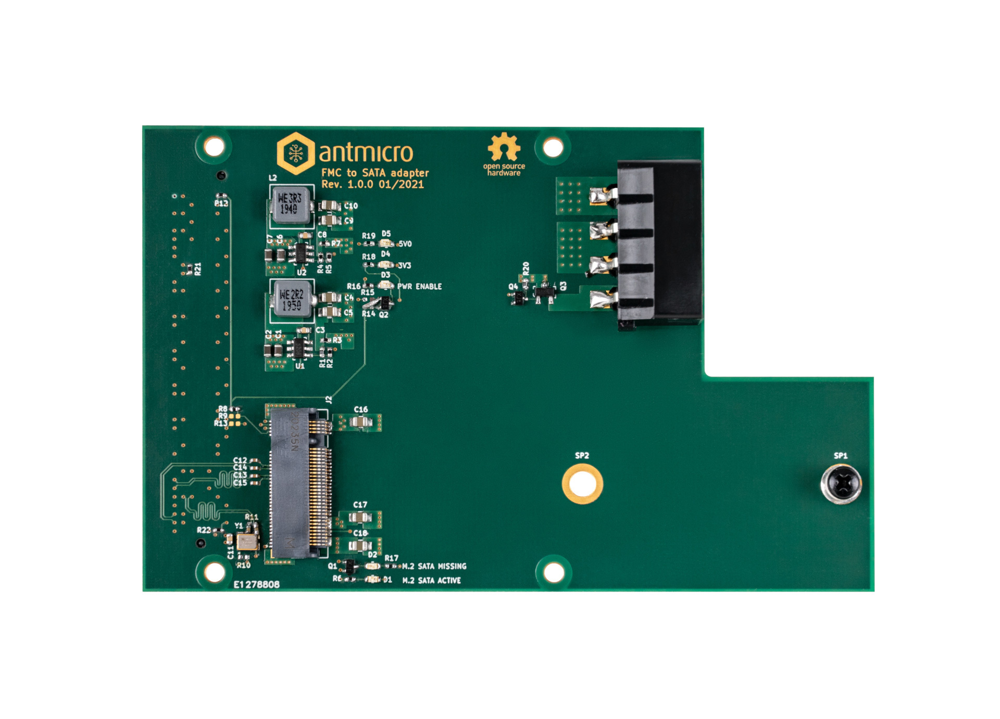

===================
FMC to SATA Adapter
===================

Copyright (c) 2021 `Antmicro <https://www.antmicro.com>`_

Overview
========

This repository includes PCB design files for an experimental expansion board for connecting SATA III SSD devices over an M.2 slot to FMC mezzanine connectors available on many FPGA development platforms including Digilent `Nexys Video Artix-7 Board <https://store.digilentinc.com/nexys-video-artix-7-fpga-trainer-board-for-multimedia-applications/>`_.

License
=======

`Apache-2.0 <LICENSE>`_
