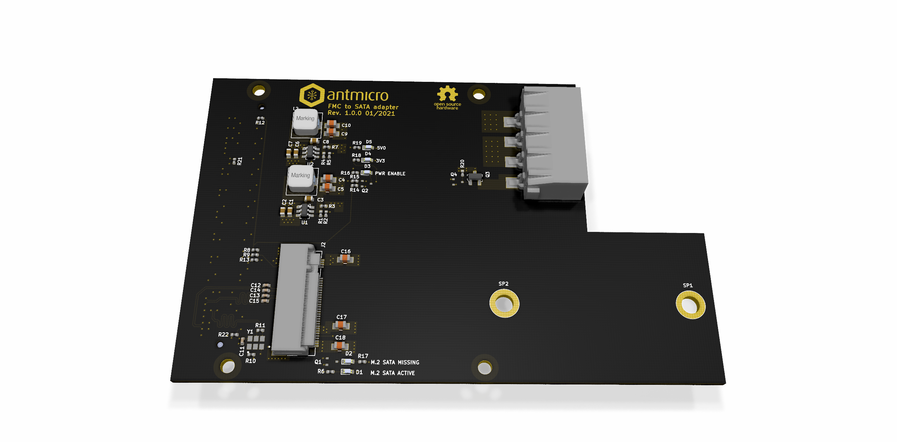

===================
FMC to SATA Adapter
===================

Copyright (c) 2021 `Antmicro <https://www.antmicro.com>`_

Overview
========

This repository includes PCB design files for an experimental expansion board allowing to connect SATA III SSD devices over M.2 slot to FMC mezzanine connectors available on some of the FPGA development platforms including Digilent `Nexys Video Trainer Board <https://store.digilentinc.com/nexys-video-artix-7-fpga-trainer-board-for-multimedia-applications/>`_.

Design status
-------------

Prototyping  and hardware verification of rev 1.0.0 is now in progress.

License
=======

`MIT <LICENSE>`_
